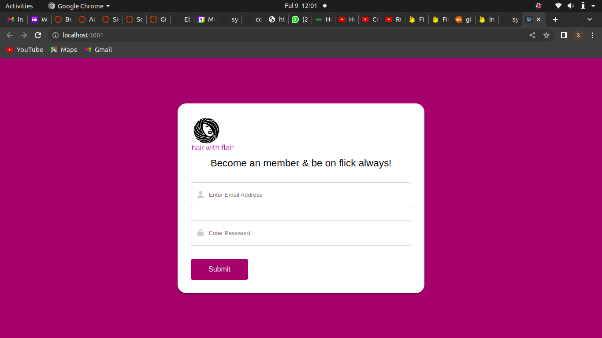
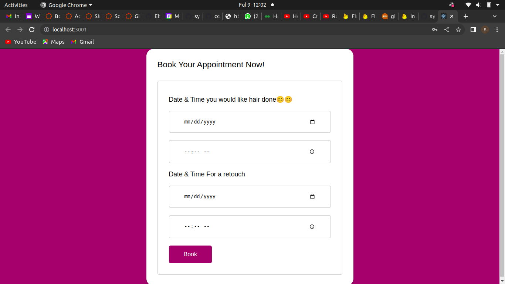
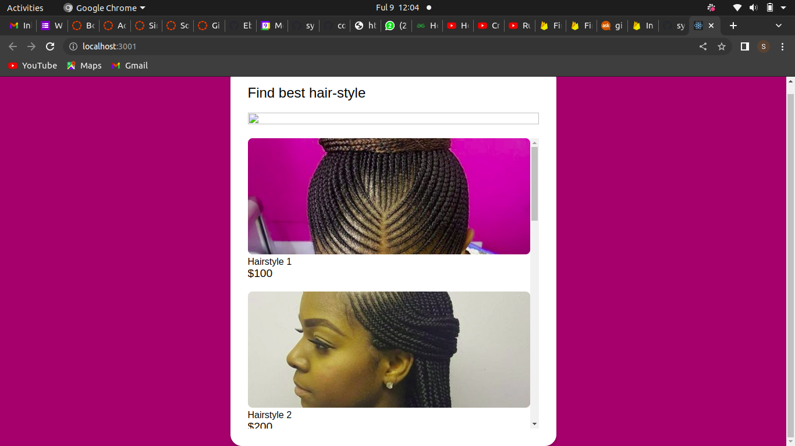

# Hair-with-Flair
### App deploy link: https://hair-with-flair.netlify.app/

## by sylvia boyani

## Home Page

## Booking Page

## More Info

 
 

## Table of Content

- [Description](#description)
- [Features](#features)
- [Requirements](#requirements)
- [Installation Process](#installation-Process)
- [Live Link](#Live-Link)
- [Technology  Used](#technology-Used)
- [Licence](#licence)
- [Authors Info](#Authors-Info) -

## Description

  
This project is about a simple booking app, where a user logs in and books an appointment for their hair to be done.

## Features
As a user of the application,you will be able to :
1. Log into the app.
1. Book an appointment for their to be done and submit the entry.

### Requirements

- Access to  a computer or any other garget
- Access to internet

### Installation Process

- Clone to their repo : git clone <https://github.com/sylvia-boyani/do-my-hair.git>
- Unzip the downloaded files in a folder of choice.
- open the folder and one can run npm start to start the app in any(chrome) browser.

 Getting Started with Create React App

This project was bootstrapped with [Create React App](https://github.com/facebook/create-react-app).

#### Available Scripts

In the project directory, you can run:

#### `npm start`

Runs the app in the development mode.\
Open [http://localhost:3000](http://localhost:3000) to view it in your browser.

The page will reload when you make changes.\
You may also see any lint errors in the console.

### Heroku live link <https://phase2-project-sly.herokuapp.com/>

### Backend link <https://github.com/sylvia-boyani/phase-3-sinatra-react-project.git>

### Technology used

- React - to create the frontend part of the app.
- Ruby - to create the backend of the project.
       -uses active record and Sinatra for accessing the database.
- Heroku - to host the react App.
         - to create the API
         - to host the backend(API) of the project.

### License

 Copyright (c) [2022] [sylvia boyani]
Permission is hereby granted, free of charge, to any person obtaining a copy
of this software and associated documentation files (the "Software"), to deal
in the Software without restriction, including without limitation the rights
to use, copy, modify, merge, publish, distribute, sublicense, and/or sell
copies of the Software, and to permit persons to whom the Software is
furnished to do so, subject to the following conditions:
The above copyright notice and this permission notice shall be included in all
copies or substantial portions of the Software.
THE SOFTWARE IS PROVIDED "AS IS", WITHOUT WARRANTY OF ANY KIND, EXPRESS OR
IMPLIED, INCLUDING BUT NOT LIMITED TO THE WARRANTIES OF MERCHANTABILITY,
FITNESS FOR A PARTICULAR PURPOSE AND NONINFRINGEMENT. IN NO EVENT SHALL THE
AUTHORS OR COPYRIGHT HOLDERS BE LIABLE FOR ANY CLAIM, DAMAGES OR OTHER
LIABILITY, WHETHER IN AN ACTION OF CONTRACT, TORT OR OTHERWISE, ARISING FROM,
OUT OF OR IN CONNECTION WITH THE SOFTWARE OR THE USE OR OTHER DEALINGS IN THE
SOFTWARE.

### Authors' info

Feel free to reach out via:

- LinkedIn Profile - [Sylvia Boyani](https://www.linkedin.com/in/sylvia-boyani)
- Instagram - [boyani_sylvia](https://boyani_sylvia.intagram/)
- twitter -[boyaniSylvia](https://twitter.com/BoyaniSylvia)

